# Chatbot avec Spring AI , RAG et Client telegram - MCP

## ChatBot partie telegram

Cette partie présente le fonctionnement du chatbot côté **Telegram**, incluant l’interaction utilisateur, la réception des messages et les réponses générées par le backend Spring AI.

### Aperçu en images

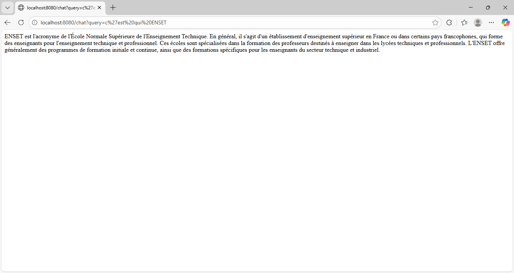

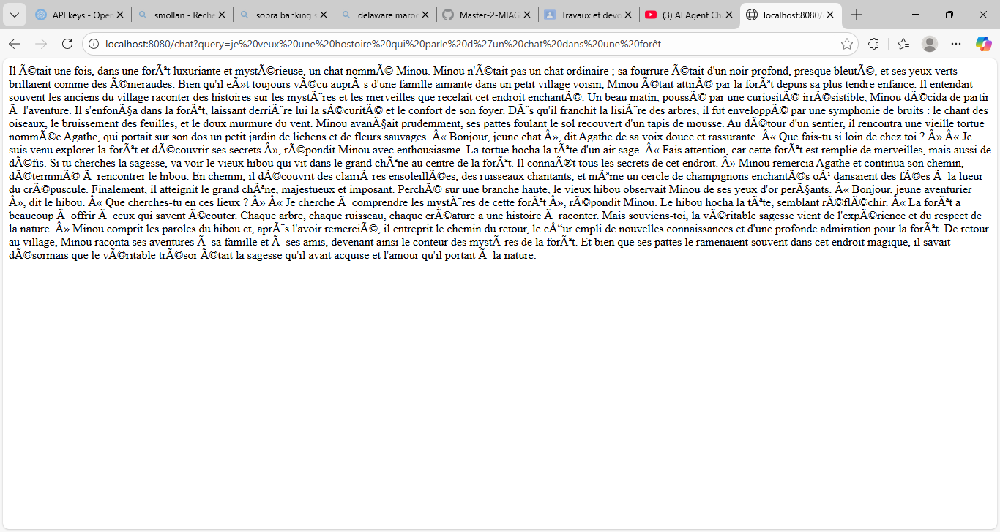
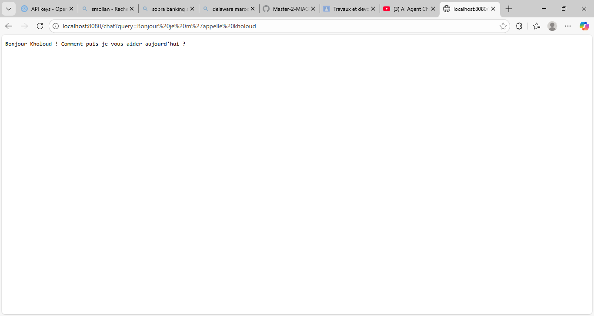
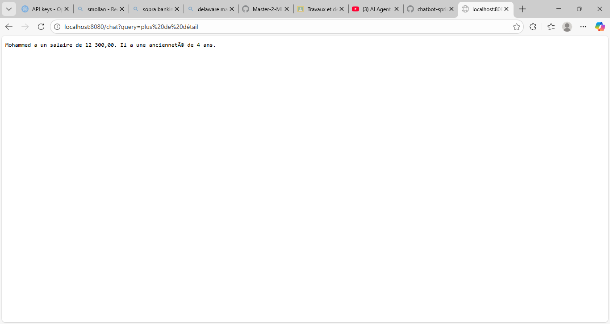
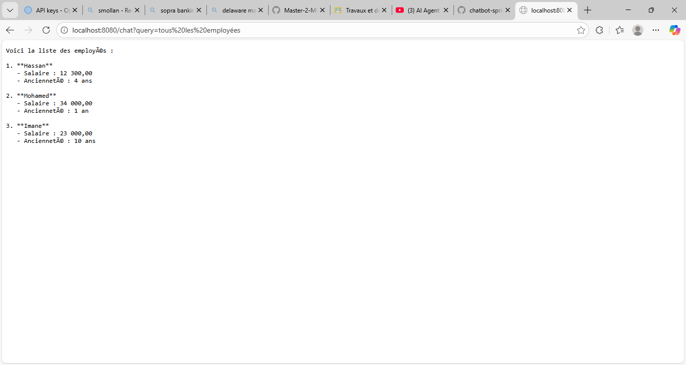

### Autres vues Telegram

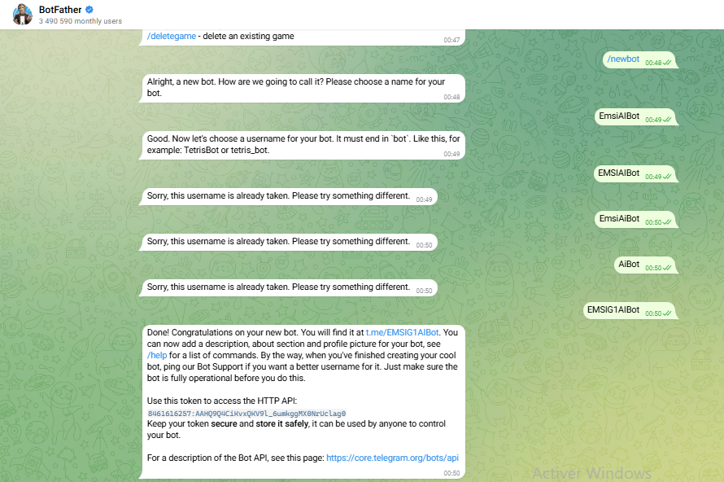
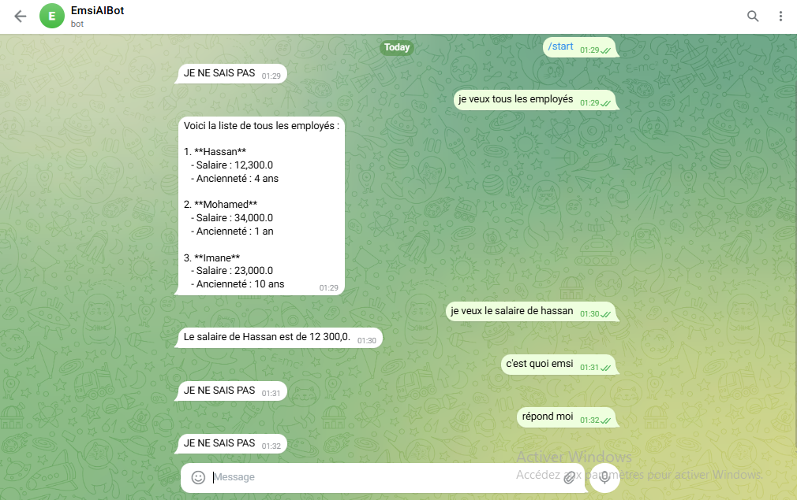

---

## ChatBot partie RAG

Cette partie illustre le **Retrieval-Augmented Generation (RAG)**, incluant l’indexation des documents, la recherche sémantique et la génération de réponses enrichies par le contexte.

### Aperçu en images

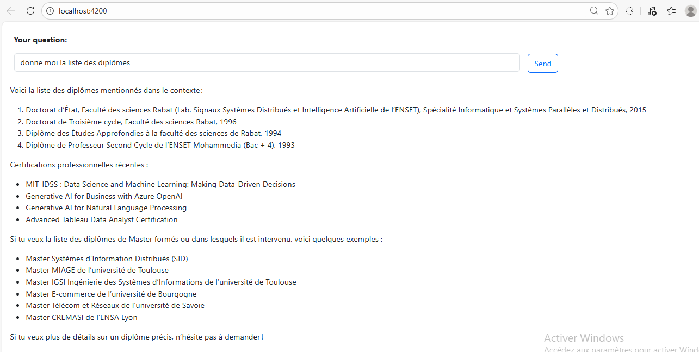

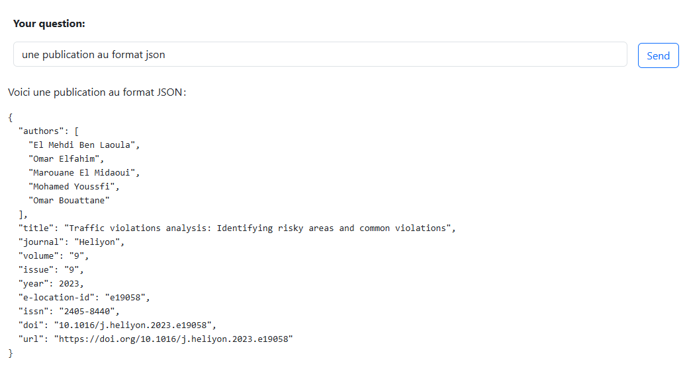
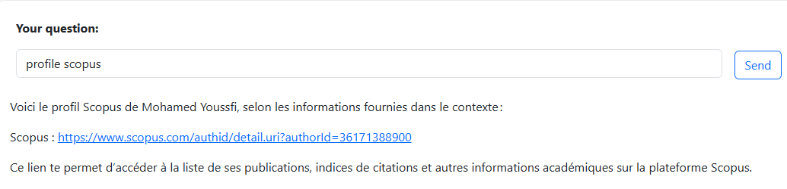
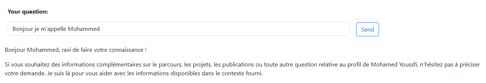
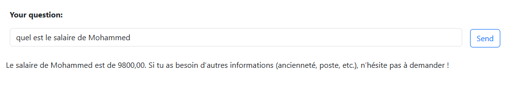
